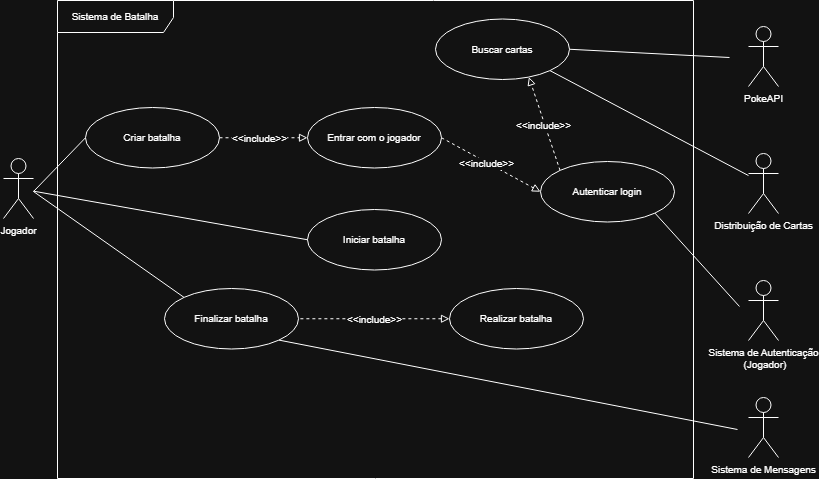
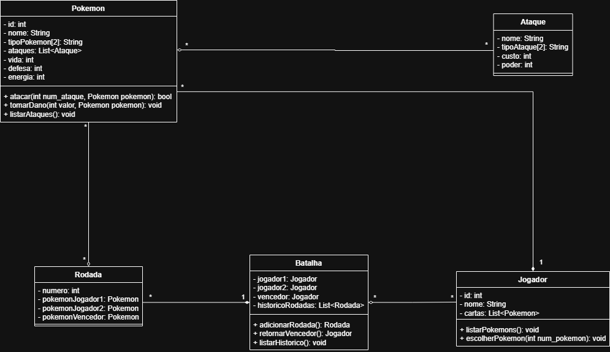

# Tema 08 - Sistema de Batalha Pokémon

## Descrição

Este projeto tem como objetivo o desenvolvimento de um **Sistema de Batalha Pokémon** executado em um **sistema embarcado**, com funcionamento local entre jogadores, realizando batalhas entre seus Pokémons.

---
## Índice

- [Visão Geral da Aplicação](#visão-geral-da-aplicação)
- [Diagramas](#diagramas)

---

## Visão Geral da Aplicação

O sistema representa a simulação de uma **batalha Pokémon**, sendo responsável por executar combates locais entre jogadores em um sistema embarcado.

Seu funcionamento envolve:

- autenticação dos jogadores;
- seleção e utilização de Pokémons;
- execução das batalhas com substituição de Pokémons durante o combate;
- definição do vencedor ao derrotar todos os Pokémons do adversário;
- integração com a PokéAPI, sistema de autenticação, distribuição de cartas e sistema de mensagens.

A batalha ocorre entre dois jogadores, onde cada um seleciona um Pokémon para o combate. Quando um Pokémon é derrotado, o jogador deve escolher outro para substituí-lo, enquanto o Pokémon vencedor permanece em campo para enfrentar o próximo adversário. Vence o jogador que derrotar todos os Pokémons do adversário.

---

## Diagramas

### Diagrama de Caso de Uso

---

### Diagrama de Classes

