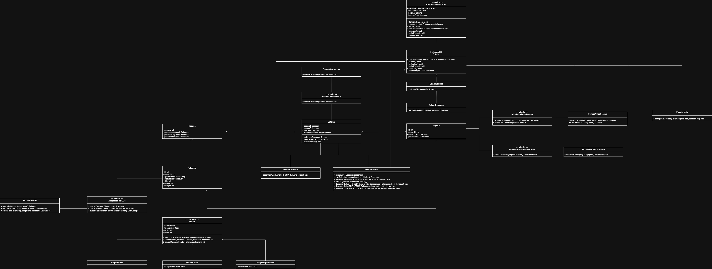

# Tema 08 - Sistema de Batalha Pokémon

## Descrição

Este projeto tem como objetivo o desenvolvimento de um **Sistema de Batalha Pokémon** executado em um **sistema embarcado**, com funcionamento local entre jogadores, realizando batalhas entre seus Pokémons.


## Demonstração

O vídeo abaixo apresenta o funcionamento do sistema, a arquitetura adotada e a demonstração da batalha Pokémon em ambiente embarcado.

▶️ https://youtu.be/IcOgGrUpPuI

## Contribuidores

- [Gustavo Pivoto Ambrósio](https://github.com/GustavoPivoto)
- [Maria Clara Pereira Campos](https://github.com/Mariaclarapcampos)
- [Patrick Augusto Lins de Oliveira Damião](https://github.com/Pack0042)
- [Pedro Henrique de Paula Andrade](https://github.com/phandrad3)

## Índice

- [Visão Geral da Aplicação](#visão-geral-da-aplicação)
- [Arquitetura da Aplicação](#arquitetura-da-aplicação)
- [Padrões de Projeto](#padrões-de-projeto)
- [Fluxo da Aplicação](#fluxo-da-aplicação)
- [Sistema de Batalha](#sistema-de-batalha)
- [Integração MQTT](#integração-mqtt)
- [Estrutura do Projeto](#estrutura-do-projeto)
- [Tecnologias Utilizadas](#tecnologias-utilizadas)
- [Diagramas](#diagramas)

## Visão Geral da Aplicação

O sistema representa a simulação de uma **batalha Pokémon**, sendo responsável por executar combates locais entre jogadores em um sistema embarcado.

Seu funcionamento envolve:

- seleção e utilização de Pokémons;
- execução das batalhas;
- definição do vencedor ao derrotar todos os Pokémons do adversário;
- integração com a PokéAPI, sistema de autenticação, distribuição de cartas e sistema de mensagens.

A batalha ocorre entre dois jogadores, onde cada um seleciona um Pokémon para o combate. Quando um Pokémon é derrotado, o jogador deve escolher outro para substituí-lo, enquanto o Pokémon vencedor permanece em campo para enfrentar o próximo adversário. Vence o jogador que derrotar todos os Pokémons do adversário.

# Arquitetura da Aplicação

O sistema foi projetado para execução em um ambiente embarcado utilizando ESP32, display TFT/LCD, cartão SD e conexão Wi-Fi.

A aplicação segue uma arquitetura baseada no padrão State, onde cada tela da aplicação é representada por um estado concreto responsável por exibir informações, tratar entradas do usuário e controlar a evolução do fluxo do sistema.

Os principais módulos do sistema são:

### Camada de Aplicação

Responsável pelo gerenciamento dos estados da aplicação, tratamento de eventos do usuário, controle do fluxo de execução e coordenação das transições entre os estados do sistema.

Estados:

- EstadoLogin
- EstadoSelecao
- EstadoBatalha
- EstadoResultado

Todos os estados herdam de:

```text
Estado
```

### Camada de Domínio

Responsável pelas regras de negócio do jogo.

Principais entidades:

- Jogador
- Pokemon
- Ataque
- Rodada
- Batalha

### Camada de Serviços

Responsável pela comunicação com sistemas externos.

Serviços:

- ServicoAutenticacao
- ServicoPokeAPI
- ServicoDistribuicaoCartas
- ServicoMensagens

# Padrões de Projeto

O projeto utiliza padrões de projeto para promover desacoplamento, reutilização de código, organização arquitetural e facilidade de manutenção. Os padrões adotados foram **Singleton**, **State** e **Adapter**.

## Singleton

O padrão **Singleton** foi aplicado na classe:

```text
ControladorAplicacao
```

Seu objetivo é garantir que exista apenas uma instância responsável por coordenar o funcionamento geral da aplicação.

No código, essa implementação é realizada através de um método estático responsável por fornecer acesso à única instância existente da classe, enquanto o construtor permanece privado para impedir a criação de novos objetos.

O `ControladorAplicacao` atua como ponto central do sistema, armazenando informações essenciais para a execução da aplicação, como:

```text
- Estado atual
- Batalha em execução
- Jogador 1
- Jogador 2
```

Além disso, ele é responsável por gerenciar os estados disponíveis e delegar a execução para o estado atualmente ativo, garantindo que toda a aplicação utilize uma única referência de controle.

## State

O padrão **State** foi utilizado para representar o fluxo da aplicação.

Cada etapa do sistema é implementada como um estado concreto:

```text
EstadoLogin
EstadoSelecao
EstadoBatalha
EstadoResultado
```

Todos os estados herdam da classe abstrata:

```text
Estado
```

Essa classe define os comportamentos comuns que todos os estados devem implementar, como atualização, renderização e tratamento de eventos.

O fluxo da aplicação é representado pelas transições entre os estados. Cada estado é responsável por executar sua própria lógica e, quando necessário, solicitar a mudança para o próximo estado do sistema.

Fluxo representado no diagrama:

```text
EstadoLogin -> EstadoSelecao -> EstadoBatalha -> EstadoResultado
```

O `ControladorAplicacao` mantém a referência para o estado atualmente ativo e delega sua execução. Dessa forma, cada estado concentra apenas o comportamento referente à sua etapa da aplicação, tornando o código mais organizado, modular e de fácil manutenção.

## Adapter

O padrão **Adapter** foi definido na arquitetura para desacoplar os serviços externos das entidades internas do sistema.

Os adaptadores planejados são:

```text
AdaptadorPokeAPI
AdaptadorAutenticacao
AdaptadorDistribuicaoCartas
AdaptadorMensagem
```

Seu objetivo é converter os dados recebidos ou enviados por serviços externos para os modelos utilizados internamente pelo domínio da aplicação.

Fluxos previstos:

```text
ServicoPokeAPI -> AdaptadorPokeAPI -> Pokemon / Ataque
```

```text
ServicoAutenticacao -> AdaptadorAutenticacao -> Jogador
```

```text
ServicoDistribuicaoCartas -> AdaptadorDistribuicaoCartas -> List<Pokemon>
```

```text
Batalha -> AdaptadorMensagem -> ServicoMensagens -> Broker MQTT
```

Com essa abordagem, as entidades de domínio permanecem independentes do formato utilizado pelos serviços externos, reduzindo o acoplamento e facilitando futuras alterações ou substituições de integrações.

No caso do `AdaptadorMensagem`, ele é responsável por converter o resultado da batalha para o formato JSON esperado pelo serviço de mensagens, que publica o payload no broker MQTT.

> Observação: os adaptadores fazem parte da arquitetura definida para o projeto e serão implementados conforme a evolução da integração com os serviços externos.


## Resumo dos Padrões Aplicados

| Padrão    | Classe/Elemento                                                                                 | Função no Projeto                                                                        |
| --------- | ----------------------------------------------------------------------------------------------- | ---------------------------------------------------------------------------------------- |
| Singleton | `ControladorAplicacao`                                                                          | Garantir uma única instância central para controlar a aplicação                          |
| State     | `Estado`, `EstadoLogin`, `EstadoSelecao`, `EstadoBatalha`, `EstadoResultado`                    | Organizar o fluxo da aplicação através de estados independentes                          |
| Adapter   | `AdaptadorPokeAPI`, `AdaptadorAutenticacao`, `AdaptadorDistribuicaoCartas`, `AdaptadorMensagem` | Converter dados externos e resultados internos para os formatos esperados pelos serviços |

# Fluxo da Aplicação

A aplicação segue o fluxo:

```text
Login -> Seleção de Pokémon -> Batalha -> Resultado
```

Cada etapa corresponde a um estado concreto da aplicação.

```text
EstadoLogin -> EstadoSelecao -> EstadoBatalha -> EstadoResultado
```

O fluxo da aplicação é conduzido pelos estados concretos. Cada estado executa sua própria lógica e pode solicitar ao `ControladorAplicacao` a troca para o próximo estado. O controlador atua como contexto central, mantendo a referência para o estado ativo e delegando a ele as operações de entrada, atualização e renderização.
# Sistema de Batalha

A batalha ocorre entre dois jogadores.

Cada jogador recebe uma equipe de Pokémons e seleciona um deles para iniciar o combate.

Durante a batalha:

- os jogadores alternam seus turnos;
- cada Pokémon utiliza seus ataques;
- os danos são calculados conforme o tipo de ataque utilizado;
- quando um Pokémon é derrotado, outro Pokémon da equipe assume seu lugar;
- o Pokémon vencedor permanece em campo;
- a batalha continua até que todos os Pokémons de um dos jogadores sejam derrotados.

O vencedor da batalha é armazenado na entidade:

```text
Batalha
```

e posteriormente enviado para o sistema de mensagens.
# Integração MQTT

Após o encerramento de uma batalha, o resultado é enviado para um broker MQTT público.

## Broker

```text
broker.hivemq.com
```

## Porta

```text
1883
```

## Tópico

```text
LawlessLandResults
```

## Serviço Responsável

```text
ServicoMensagens
```

O envio das informações permite que aplicações externas possam acessar os resultados das batalhas.

### Estrutura da Mensagem

A mensagem enviada ao broker MQTT é em formato JSON.

Exemplo de payload:

```json
{
  "vencedor": "gustavo",
  "jogador1": "gustavo",
  "jogador2": "jonas",
  "rodadas": [
    {
      "n": 1,
      "gustavo": "ivysaur",
      "jonas": "bulbasaur",
      "vencedor": "ivysaur",
      "vencedorJogador": "gustavo"
    },
    {
      "n": 2,
      "gustavo": "ivysaur",
      "jonas": "butterfree",
      "vencedor": "butterfree",
      "vencedorJogador": "jonas"
    },
    {
      "n": 3,
      "gustavo": "wartortle",
      "jonas": "butterfree",
      "vencedor": "wartortle",
      "vencedorJogador": "gustavo"
    },
    {
      "n": 4,
      "gustavo": "wartortle",
      "jonas": "caterpie",
      "vencedor": "caterpie",
      "vencedorJogador": "jonas"
    },
    {
      "n": 5,
      "gustavo": "blastoise",
      "jonas": "caterpie",
      "vencedor": "blastoise",
      "vencedorJogador": "gustavo"
    },
    {
      "n": 6,
      "gustavo": "blastoise",
      "jonas": "charmander",
      "vencedor": "blastoise",
      "vencedorJogador": "gustavo"
    },
    {
      "n": 7,
      "gustavo": "blastoise",
      "jonas": "metapod",
      "vencedor": "metapod",
      "vencedorJogador": "jonas"
    },
    {
      "n": 8,
      "gustavo": "charmeleon",
      "jonas": "metapod",
      "vencedor": "charmeleon",
      "vencedorJogador": "gustavo"
    }
  ]
}
```
# Estrutura do Projeto

```text
firmware/
└── Pokemon_Lawless_Land/
    ├── include/
    ├── online/
    ├── sdcard/
    ├── src/
    ├── test/
    ├── ARQUITETURA.md
    └── platformio.ini
```

Onde:

* **online/**: armazena recursos e arquivos relacionados às integrações externas utilizadas pelo sistema.
* **sdcard/**: contém os dados carregados localmente pelo cartão SD, como informações de Pokémons, ataques e demais recursos utilizados durante a execução.
* **include/**: arquivos de cabeçalho compartilhados pelo projeto.
* **test/**: testes da aplicação.

## Principais módulos

```text
src/
├── app/
├── contratos/
├── dominio/
└── infra/
```

Onde:

* **app/**: responsável pelo controle do fluxo da aplicação, gerenciamento dos estados e coordenação da execução do sistema.
* **contratos/**: contém interfaces e abstrações utilizadas para desacoplar os módulos da aplicação.
* **dominio/**: contém as entidades e regras de negócio da batalha Pokémon, como Jogador, Pokémon, Ataque, Rodada e Batalha.
* **infra/**: responsável pela integração com recursos externos, como autenticação, carregamento de dados, comunicação MQTT, acesso ao cartão SD e demais serviços da plataforma.


# Tecnologias Utilizadas

- C++
- PlatformIO
- ESP32
- Display LCD
- HiveMQ

## Diagramas

### Diagrama de Caso de Uso


---

### Diagrama de Classes

